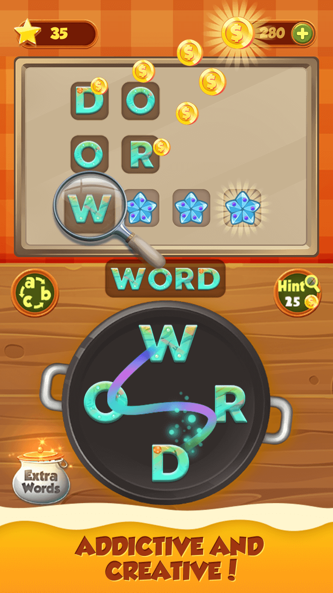
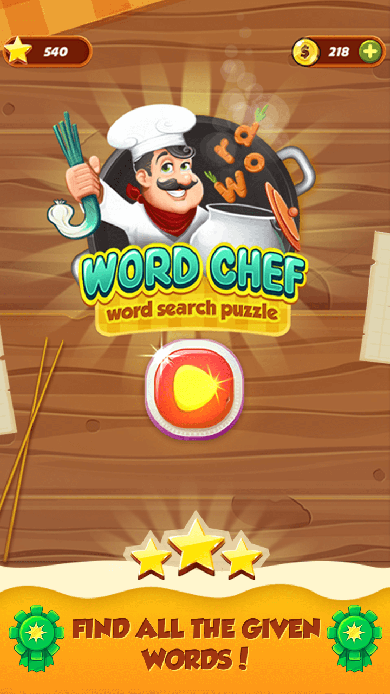
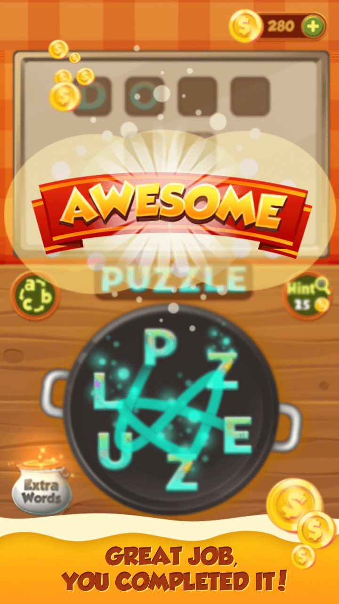
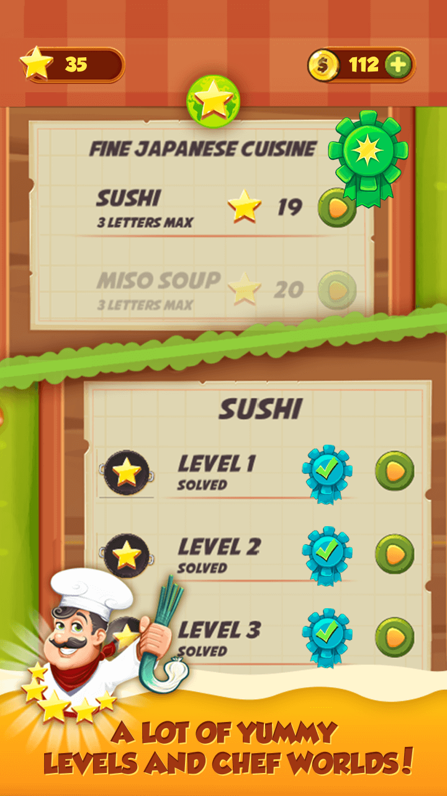
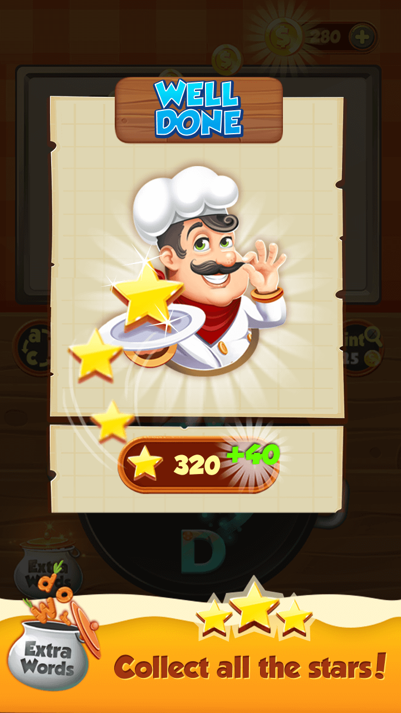

# Word-Chef

  
  
  
  
  

## Features
  * Different difficulty levels – make words out of 3 letters first, and progress all the way to 7 letter-levels!
  * Special bonus levels for extra coins and even more fun!
  * If you get stuck, use the Hint button and get the first letter of the word!
  * Daily Reward
  

## [DOCUMENTATION](https://github.com/spatel210/Word-Chef/blob/main/WordChef.pdf)
